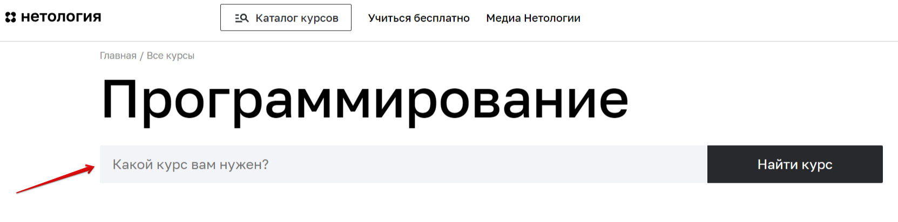
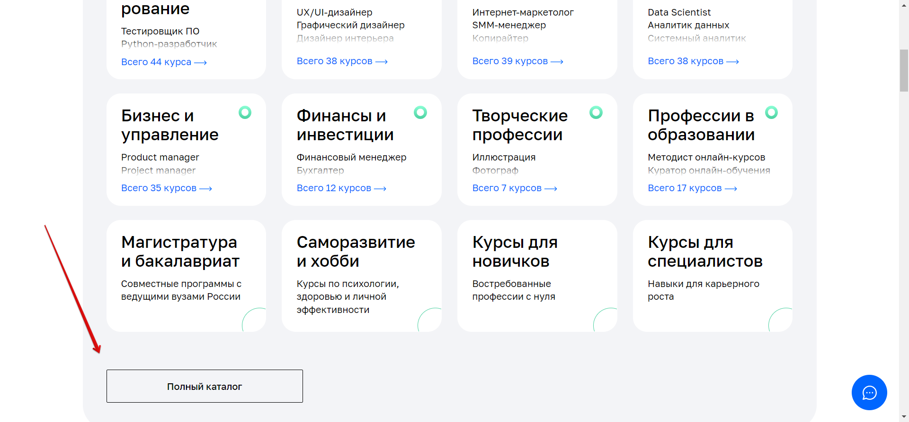
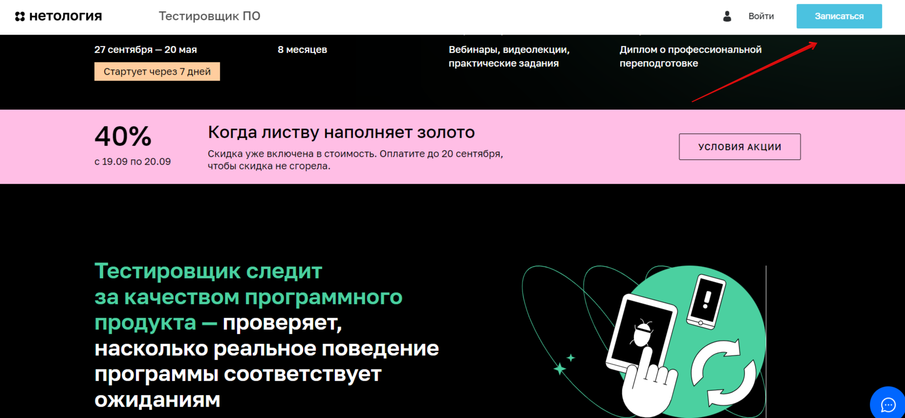
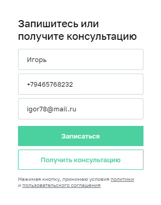

# План автоматизации тестирования сценариев перехода к форме записи и заполнения этой формы
***
## 1. Перечень автоматизируемых сценариев
### 1.1.  Сценарии перехода на страницу профессии
Описание всех 9 сценариев в виде блок-схемы:

#### *ПСП.1. Переход на страницу профессии с помощью меню "Каталог курсов" и строки поиска*
*Шаги:*
1.	На главной странице Нетологии (https://netology.ru) нажать на меню "Каталог курсов".
2.	В выпадающем блоке в поле поиска ввести "Тестировщик ПО".
3.	В появившемся списке вариантов выбрать "Тестировщик ПО".

*Ожидаемый результат:*  
1. Переход на страницу профессии "Тестировщик ПО".

#### *ПСП.2. Переход на страницу профессии с помощью меню "Каталог курсов", выбора пункта "Программирование" и последующего выбора из списка*
*Шаги:*
1.	На главной странице Нетологии (https://netology.ru) нажать на меню "Каталог курсов".
2.	В выпадающем блоке выбрать из отображающегося списка "Программирование".
3.	На появившейся странице выбрать в предложенном списке из 44 вариантов "Тестировщик ПО".

*Ожидаемый результат:*
1. Переход на страницу профессии "Тестировщик ПО".

#### *ПСП.3. Переход на страницу профессии с помощью меню "Каталог курсов", выбора пункта "Программирование" и строки поиска в нем*
*Шаги:*
1.	На главной странице Нетологии (https://netology.ru) нажать на меню "Каталог курсов".
2.	В выпадающем блоке выбрать из отображающегося списка "Программирование".
3.	На появившейся странице в поле поиска ввести "Тестировщик ПО".
4.	В появившемся списке вариантов выбрать "Тестировщик ПО".

*Ожидаемый результат:*
1. Переход на страницу профессии "Тестировщик ПО".

#### *ПСП.4. Переход на страницу профессии с помощью меню "Каталог курсов", выбора пункта "Программирование" и отметки чекбокса "Тестирование ПО"*
*Шаги:*
1.	На главной странице Нетологии (https://netology.ru) нажать на меню "Каталог курсов".
2.	В выпадающем блоке выбрать из отображающегося списка "Программирование".
3.	На появившейся странице справа в дополнительных фильтрах в подразделе "Навыки" отметить чекбокс "Тестирование ПО".
4.	В появившемся списке вариантов выбрать "Тестировщик ПО"

*Ожидаемый результат:*
1. Переход на страницу профессии "Тестировщик ПО".

#### *ПСП.5. Переход на страницу профессии с помощью раздела "Направления обучения", выбора пункта "Программирование" и последующего выбора из списка*
*Шаги:*
1.	На главной странице Нетологии (https://netology.ru) в разделе "Направления обучения" нажать на подраздел "Программирование".
2.	На появившейся странице выбрать в предложенном списке из 44 вариантов "Тестировщик ПО".

3. *Ожидаемый результат:*
1. Переход на страницу профессии "Тестировщик ПО".

#### *ПСП.6. Переход на страницу профессии с помощью раздела "Направления обучения", выбора пункта "Программирование" и строки поиска в нем*
*Шаги:*
1.	На главной странице Нетологии (https://netology.ru) в разделе "Направления обучения" нажать на подраздел "Программирование".
2.	На появившейся странице в поле поиска ввести "Тестировщик ПО".
3.	В появившемся списке вариантов выбрать "Тестировщик ПО".

*Ожидаемый результат:*
1. Переход на страницу профессии "Тестировщик ПО".

#### *ПСП.7. Переход на страницу профессии с помощью раздела "Направления обучения", выбора пункта "Программирование" и отметки чекбокса "Тестирование ПО"*
*Шаги:*
1.	На главной странице Нетологии (https://netology.ru) в разделе "Направления обучения" нажать на подраздел "Программирование".
2.	На появившейся странице справа в дополнительных фильтрах в подразделе "Навыки" отметить чекбокс "Тестирование ПО".
3.	В появившемся списке вариантов выбрать "Тестировщик ПО".

*Ожидаемый результат:*
1. Переход на страницу профессии "Тестировщик ПО".

#### *ПСП.8. Переход на страницу профессии с помощью выбора полного каталога в разделе "Направления обучения" и строки поиска в нем*
*Шаги:*
1.	На главной странице Нетологии (https://netology.ru) в разделе "Направления обучения" выбрать "Полный каталог".
2.	На появившейся странице в поле поиска ввести "Тестировщик ПО".
3.	В появившемся списке вариантов выбрать "Тестировщик ПО".

*Ожидаемый результат:*
1. Переход на страницу профессии "Тестировщик ПО".

#### *ПСП.9. Переход на страницу профессии с помощью выбора полного каталога в разделе "Направления обучения" и отметки чекбокса "Тестирование ПО"*
*Шаги:*
1.	На главной странице Нетологии (https://netology.ru) в разделе "Направления обучения" выбрать "Полный каталог".
2.	На появившейся странице справа в дополнительных фильтрах в подразделе "Навыки" отметить чекбокс "Тестирование ПО".
3.	В появившемся списке вариантов выбрать "Тестировщик ПО".

*Ожидаемый результат:*
1. Переход на страницу профессии "Тестировщик ПО".

### 1.2. Сценарии перехода к форме записи
#### *ПФЗ.1. Переход к форме записи с помощью кнопки "Записаться"*
*Шаги:*
1.	На странице профессии "Тестировщик ПО" нажать на кнопку "Записаться".

*Ожидаемый результат:*
1. Переход к форме записи.

#### *ПФЗ.2. Переход к форме записи с помощью кнопки "Записаться", появляющейся после прокрутки вниз*
*Шаги:*
1.	На странице профессии "Тестировщик ПО" прокрутить колесом мыши вниз до появления сверху всплывающего подраздела.
2.	Нажать кнопку "Записаться" в этом подразделе.

*Ожидаемый результат:*
1. Переход к форме записи.

#### *ПФЗ.3. Переход к форме записи внизу страницы*
*Шаги:*
1.	На странице профессии "Тестировщик ПО" прокрутить страницу вниз почти до подвала.

*Ожидаемый результат:*
1. Переход к форме записи.

### 1.3. Сценарии заполнения формы
***Валидные входные данные:***

- **Поле Имя:** Набор латинских букв или кириллицы длинною от двух символов с возможными пробелами и дефисом (Напр. Игорь).  
- **Поле Телефон:** Номер в формате +9 (999) 999-99-99 (Напр. +79465768232).  
- **Поле Электронная почта:** строка в формате aaa@bbb.cc. "aaa" и "bbb" могут состоять из латинских букв или цифр, а "сс" только латинские буквы (Напр. igor78@mail.ru).  

***Невалидные входные данные:***

- **Поле Имя:** Числа, символы, иероглифы, пустое поле, одна латинская буква или одна буква кириллицы.  
- **Поле Телефон:** Буквы, символы, иероглифы, пустое поле или номер в неправильном формате, т.е. без "+", длиннее, короче.  
- **Поле Электронная почта:** не соблюдение формата - отсутствие значка "@" или ".", цифры после точки.  

#### *ЗФ.1. Заполнение формы валидными данными*
*Шаги:*
1.	После попадания в форму записи на курс заполнить ее валидными данными
2.	Нажать кнопку "Отправить"

  

*Ожидаемый результат:*
1. Сообщение: "Вы успешно записались на курс. Вам на почту придет сообщение от нашего менеджера."

#### *ЗФ.2. Заполнение формы данными с невалидным именем*
*Шаги:*
1.	После попадания в форму записи на курс заполнить поле Имя невалидными данными, а остальные поля валидными данными
2.	Нажать на кнопку "Отправить"

*Ожидаемый результат:*
1. Ошибка.
2. Сообщение под полем Имя: "Должно состоять из букв" или "Должно быть не короче двух символов".
3. Кнопка не нажимается.

#### *ЗФ.3. Заполнение формы данными с невалидным телефоном*
*Шаги:*
1.	После попадания в форму записи на курс заполнить поле Телефон невалидными данными, а остальные поля валидными данными
2.	Нажать на кнопку "Отправить"

*Ожидаемый результат:*
1. Ошибка. 
2. Сообщение под полем Телефон: "Номер в формате +9 (999) 999-99-99". 
3. Кнопка не нажимается.

#### *ЗФ.4. Заполнение формы данными с невалидной Электронной почтой*
*Шаги:*
1.	После попадания в форму записи на курс заполнить поле Электронная почта невалидными данными, а остальные поля валидными данными
2.	Нажать на кнопку "Отправить"

*Ожидаемый результат:*
1. Ошибка.
2. Сообщение под полем Электронная почта: "Неверный email".
3. Кнопка не нажимается.

 
***

## 2. Перечень используемых инструментов с обоснованием выбора
1.	Редактор кода IntelliJ IDEA (включает возможность работы с Git, базами данных (на случай использования SUT через СУБД))
2.	Язык программирования Java
3.	Сборщик проектов Gradle (проще записывать конструкции в файле с настройками)
4.	Тестовая платформа JUnit5 (хорошо подходит для тестирования)
5.	Фреймворк для автотестирования веб-приложений Selenide (более мощные селекторы)
6.	Система контроля версий Git
7.	Площадка для хранения тестов GitHub
8.	DevTools (необходим для поиска локаторов)
9.	AppVeyor для Continuous Integration (для более удобной сборки тестов)
***

## 3. Перечень необходимых разрешений, данных и доступов
1.	Разрешение на выполнение автотестов от владельца сайта
2.	Требования к сайту, описание валидности/невалидности данных
3.	Доступ к БД (для получения тестовых данных). В случае тестирования не через графический интерфейс, а через API, необходимы доступ к API
***

## 4. Перечень и описание возможных рисков при автоматизации
1.	Отсутствие необходимых разрешений, доступов и тестовых данных
2.	Технический сбой на сайте или сбой используемых инструментов, в т.ч. Интернет, железо и пр.
3.	Обновление используемых инструментов или сайта, влияющих на код тестов
4.	Отсутствие специальных тестовых меток в коде сайта и невозможность их добавить. В результате лишние траты времени на разработку локаторов и селекторов
5.	Человеческий фактор в виде недееспособности специалиста
***

## 5. Перечень необходимых специалистов для автоматизации
Инженер автотестирования - 1 человек
***

## 6. Интервальная оценка с учетом рисков в часах
- Если события, описанные в рисках, не произошли, то 8-16 часов
- Если некоторые или все события, описанные в рисках, произошли, то 20-40 часов
- Если доступа и разрешений не будет, так вообще может никогда не закончится 